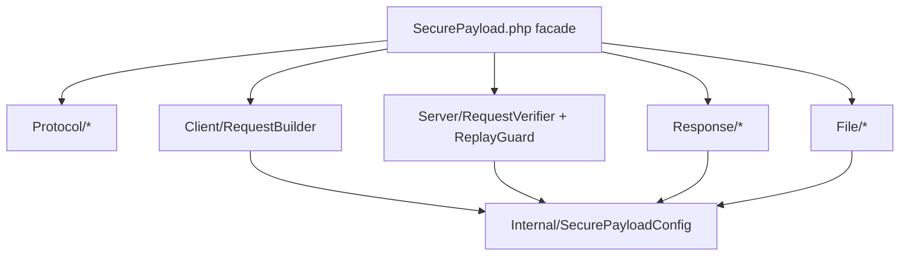

# CLAUDE.md

This file provides guidance to Claude Code (claude.ai/code) when working with code in this repository.

## What this is

`sk8dvlpr/securepayload` is a framework-agnostic PHP 8.0+ library for securing S2S / client-server HTTP requests with HMAC-SHA256 or Ed25519 signing, XChaCha20-Poly1305 AEAD encryption, and anti-replay protection. Distributed via Packagist; no application/runtime — it's a library consumed by other apps.

**Current release:** 3.1.0 | **Protocol version:** `4` (`SecurePayload::DEFAULT_VERSION`)

Note: source comments, docblocks, and exception messages are written in **Indonesian**. Match that language when editing existing code so the style stays consistent.

## Commands

```bash
composer install                      # install dev deps (phpunit, phpstan)

composer test                         # run full PHPUnit suite
vendor/bin/phpunit                    # same
vendor/bin/phpunit --testsuite Unit   # one suite: Unit | Integration | Security
vendor/bin/phpunit tests/Unit/SecurePayloadTest.php          # single file
vendor/bin/phpunit --filter testVerifyRejectsReplay          # single test by name

composer stan                         # PHPStan level 5 on src/
vendor/bin/phpstan analyse -c phpstan.neon

find src -name "*.php" -print0 | xargs -0 -n1 php -l          # syntax lint (mirrors CI)
```

CI (`.github/workflows/ci.yml`) runs validate → install → `php -l` → PHPStan → PHPUnit across PHP 8.0–8.3. `composer.json` pins `platform.php` to `8.0.28`, so locally-installed deps resolve against 8.0 even on a newer interpreter — keep new code 8.0-compatible.

Dev-only files (`tests/`, `examples/`, `.github/`, `phpunit.xml.dist`, `phpstan.neon`, `CLAUDE.md`, `docs/`) are excluded from the Composer dist via `.gitattributes` `export-ignore` — consumers get only `src/`.

## Roadmap

Phases 1–18 complete (see CHANGELOG). **Phase 18 complete**: Go middleware, RFC 9421 bridge, wire v4 + multipart, hybrid PQ signing. Full roadmap: `docs/ROADMAP.md`.

## Agent Skills

| Task | Skill |
|------|-------|
| Architecture / how X works | `.claude/skills/securepayload/securepayload-architecture/SKILL.md` |
| Implement feature / fix bug | `.claude/skills/securepayload/securepayload-development/SKILL.md` |
| Plan next phase / scope PR | `.claude/skills/securepayload/securepayload-roadmap/SKILL.md` |
| Security review | `.claude/skills/securepayload/securepayload-security-review/SKILL.md` |
| Framework integration | `.claude/skills/securepayload/securepayload-integration/SKILL.md` |

## Architecture

### Core protocol (facade + internal modules)

`src/SecurePayload.php` is the **public facade** (~400 lines): `HX_*` / `EVENT_*` constants, constructor, and delegation to internal modules. Wire protocol v3 unchanged.



| Module | Role |
|--------|------|
| `src/Protocol/` | Static formatters: `Canonical`, `Digest`, `Messages`, `Aead`, `Hkdf` — also callable via `SecurePayload::normalizePath()` etc. |
| `src/Internal/SecurePayloadConfig.php` | Constructor state, `deriveSubkey`, key helpers, `collectBoundHeaders`, `emitEvent` |
| `src/Client/RequestBuilder.php` | `buildHeadersAndBody` |
| `src/Server/RequestVerifier.php` | `verifyOrThrow` core |
| `src/Server/ReplayGuard.php` | `checkReplay`, nonce file GC |
| `src/Response/ResponseBuilder.php` / `ResponseVerifier.php` | Two-way response security |
| `src/File/` | In-memory + streaming file transfer |

- **Modes**: `'hmac'` (sign only), `'aead'` (encrypt only), `'both'` (encrypt + sign). Set at construction.
- **signAlg**: `'hmac'` (default, HMAC-SHA256) or `'ed25519'` (asymmetric request signing).
- **Client entry points**: `buildHeadersAndBody()` (core), `send()`/`sendFile()` (pluggable HTTP transport), `buildFilePayload()` (in-memory file), `buildFileStream()` (large file streaming), `verifyResponse()`/`verifyResponseOrThrow()`.
- **Server entry points**: `verify()` (safe, returns `['ok'=>bool, ...]`), `verifyOrThrow()`, `verifySimple()`, `verifyFilePayload()`, `verifyFileStream()`, `buildResponse()`.

Security headers are `X-Client-Id`, `X-Key-Id`, `X-Timestamp`, `X-Nonce`, `X-Signature-*`, `X-Body-Digest`, `X-Canonical-Request`, `X-AEAD-*` (the `HX_*` constants). Response uses `X-Resp-*` namespace.

### Completed development phases

| Phase | Version | Feature |
|-------|---------|---------|
| 1 | 1.0 | Core HMAC/AEAD/BOTH, anti-replay, KMS basics |
| 1b | 2.0 | Ed25519 request signing (`signAlg`) |
| 2 | 2.1 | Response two-way: `buildResponse()`, `verifyResponse()` |
| 3 | 2.2 | AAD binding: timestamp + `bindHeaders` (wire v3) |
| 4 | 2.3 | `Psr16ReplayStore` adapter |
| 5 | 2.4 | HKDF subkeys (`deriveKeys`, `deriveKey()`) |
| 6 | 2.5 | File streaming: `buildFileStream()`, `verifyFileStream()` |
| 7 | 2.6 | Cloud KMS: `VaultKms`, `AwsKms` |
| 8 | 2.7 | Observability: `onSecurityEvent`, `EVENT_*` constants |
| 15 | 2.8 | Enterprise ops: `GcpKms`, `AzureKeyVaultKms`, `PrometheusSecurityExporter` |
| 16 | 2.9 | Internal modularization (facade + Protocol/Client/Server/Response/File); no wire change |
| 17 | 2.10 | Webhook verifier, OpenTelemetry exporter, Node middleware, mTLS docs |
| 18a | Go | Gin/Echo/Fiber middleware (`packages/go-sdk/middleware`) |
| 18b | 2.11 | RFC 9421 bridge (`Interop/Rfc9421Bridge`) |
| 18c | 3.0 | Wire v4 + multipart file stream (`DEFAULT_VERSION=4`) |
| 18d | 3.1 | Hybrid ML-DSA44+Ed25519 (`signAlg`, `PqSignerInterface`) |
| 9 | bundle | Ed25519 response signing (mirror `signAlg`; server keypair) |
| 10 | bundle | Key rotation + grace period (`rotateKey`, `useKeyLifecycle`) |

### Security invariants (never break)

- **Canonicalization is symmetric.** Client and server must produce identical canonical method/path/query. `normalizePath()`, `canonicalQuery()` (ksort + rawurlencode), `hmacMessage()`, and `aeadNonceFrom()` are the shared formatters — changing one side without the other silently breaks all verification.
- **The server derives method/path/query from its own request input, NOT from the `X-Canonical-Request` header.** That header is a debug hint only. `verifyOrThrow()` requires the caller to pass `$method`/`$path`/`$query` explicitly. Do not "fix" verification by reading them from headers — that reintroduces a signature-spoofing vuln (see `tests/Security/SignatureSpoofingTest.php`).
- **HMAC signs the plaintext, not the ciphertext** (in `both` mode), so verification asserts the meaning of the data. The AEAD nonce is derived from the client nonce bound to method/path/query (`aeadNonceFrom`) and re-verified via `hash_equals` to prevent nonce relocation.
- Use `hash_equals` for every secret/signature comparison.
- HMAC secrets are rejected if `< 32` chars (both at construction and when loaded via keyLoader). AEAD keys must decode to exactly 32 bytes.
- **`signAlg` is determined by server configuration**, not the client's `X-Signature-Algorithm` header (anti-downgrade).
- **`deriveKeys` and `bindHeaders` must be identical** on client and server; mismatch fails closed.
- **Response is bound to the request nonce** — cannot be relocated to another request context.

### Replay protection (`checkReplay`)

Default is a **file-based** nonce cache in `sys_get_temp_dir()` with `flock` + double-checked locking and probabilistic GC. This is per-host and **does not work across multiple servers / load balancers**. For production multi-server, callers must inject a `replayStore` callback `fn(string $cacheKey, int $ttl): bool` (returns true if nonce is new) backed by Redis/Memcached. Preserve this extension point.

The replay key is `hash(clientId|keyId|nonce)` — deliberately **excludes the timestamp**, so a nonce is single-use regardless of the (unauthenticated, in `aead` mode) timestamp header. Nonces are remembered for `replayTtl + clockSkew` (the full window in which a timestamp can still pass freshness), not just `replayTtl`. Do not reintroduce the timestamp into the key or shorten the memory window — that reopens a replay bypass.

Timestamp window: rejects future beyond `clockSkew` (default 60s) and past beyond `replayTtl + clockSkew` (replayTtl default 120s).

### AAD binding (Phase 3, protocol v3)

- `X-Timestamp` is always bound to AEAD AAD (request and response).
- `bindHeaders` option binds critical header values to AAD; change or removal fails decryption.
- Client supplies bound header values via `$extraHeaders` on `buildHeadersAndBody()` / `send()`.

### HKDF subkeys (Phase 5)

Opt-in `deriveKeys => true`: master HMAC/AEAD keys derive per-function subkeys via `hash_hkdf`. Purposes: `sp-aead-req`, `sp-aead-resp`, `sp-sign-req`, `sp-sign-resp`, `sp-aead-stream`. Labels bind to protocol version. Does not apply to Ed25519 signing.

### Response security (Phase 2 + 9)

- Server: `buildResponse($requestHeaders, $payload)` after successful verify.
- Client: `verifyResponse($headers, $body, $reqNonce)` using request nonce.
- Response signing follows **`signAlg` mirror**:
  - `signAlg=hmac` (default): HMAC-SHA256 with shared secret (`hmacSecretRaw` / `keyLoader` `hmacSecret`).
  - `signAlg=ed25519`: server signs with `ed25519SecretKeyServerB64` (keyLoader or instance); client verifies with `ed25519PublicKeyServerB64`. **No shared HMAC needed for response.**
- Request Ed25519 uses **client** keypair (`ed25519SecretKeyB64` / `ed25519PublicKeyB64`); response Ed25519 uses **server** keypair — distinct keys, do not mix.

### Observability (Phase 8 + 15)

`onSecurityEvent` callback emits: `timestamp_invalid`, `replay_detected`, `decrypt_failed`, `signature_invalid`, `key_not_found`, `nonce_mismatch`. Context never contains secrets/plaintext. Callback exceptions are swallowed.

`PrometheusSecurityExporter` (Phase 15) — `src/Observability/PrometheusSecurityExporter.php`: factory `onSecurityEvent()` + `render()` Prometheus text format. Counter `securepayload_security_events_total{event=...}`. Label `client_id`/`key_id` opt-in (cardinality). Example: `examples/observability/prometheus.php`.

### Key management (`src/KMS/`)

The server loads per-(clientId, keyId) secrets through a `keyLoader` callable returning `['hmacSecret'=>?string, 'aeadKeyB64'=>?string, 'ed25519PublicKeyB64'=>?string, 'ed25519SecretKeyServerB64'=>?string, 'ed25519PublicKeyServerB64'=>?string]`. Providers implementing `SecureKeyProvider`:

- `EnvKeyProvider` — reads `SECUREPAYLOAD_{CID}_{KID}_HMAC_SECRET` / `_AEAD_KEY_B64` / `_ED25519_PUBLIC_B64` / `_ED25519_SERVER_SECRET_B64` / `_ED25519_SERVER_PUBLIC_B64` env vars.
- `DbKeyProvider` — PDO-backed (`secure_keys` table by default; column names configurable). Table/column names are validated against `^[A-Za-z_][A-Za-z0-9_]*$` since they're interpolated into SQL (values are always bound). If a row stores a *wrapped* AEAD key (`wrapped_b64` + `kek_id`) instead of plaintext, it is unwrapped via an injected `Kms`. Opt-in `useKeyLifecycle` filters `status` (`active`/`retiring`/`revoked`) + `valid_until` grace window.

Key-wrapping (encrypting the AEAD data-key with a KEK):
- `Kms` interface: `wrap()` / `unwrap()` with an AAD context array.
- `LocalKms` — XChaCha20-Poly1305 wrapping using KEKs from env (`SECURE_KEKS` list + `SECURE_KEK_{id}_B64`).
- `VaultKms` — HashiCorp Vault Transit (`derived=true` on keys).
- `AwsKms` — AWS KMS EncryptionContext (optional `aws/aws-sdk-php`).
- `GcpKms` — GCP Cloud KMS `additionalAuthenticatedData` (optional `google/cloud-kms`).
- `AzureKeyVaultKms` — Azure Key Vault Cryptography (optional `azure/keyvault-keys`).
- `KeyManager` — generates HMAC+AEAD key pairs, Ed25519 client/server pairs, optionally wraps AEAD key, emits `INSERT` SQL (`GeneratedKeyResult::toSqlInsert()`). **Rotation:** `rotateKey()` → `KeyRotationResult` with grace-period SQL; `revokeKey()`, `purgeExpiredRetiringKeys()`. See `docs/KEY_ROTATION.md`.

### Replay store (`src/ReplayStore/`)

- `Psr16ReplayStore` — wraps `Psr\SimpleCache\CacheInterface` as invokable `replayStore`. Uses atomic `add()` when available; falls back to `has()+set()` for pure PSR-16.
- Examples: `examples/replay-store/redis.php`, `memcached.php`, `psr16.php`.

### File transfer

**In-memory** (`buildFilePayload` / `verifyFilePayload`): base64-embedded in JSON under `_attachment`. Entire file in RAM (+33% overhead) — suitable for files ≤ ~10MB.

**Streaming** (`buildFileStream` / `verifyFileStream`, Phase 6): XChaCha20-Poly1305 secretstream per-chunk. Manifest sent via secure request; ciphertext uploaded separately. RAM ≈ one chunk. Fail-closed: partial plaintext deleted on verification failure.

Both support `max_size`, `allowed_exts`, `block_dangerous`, `strict_mime` magic-byte sniffing.

## Conventions

- `declare(strict_types=1)` everywhere; classes are `final`.
- Errors throw `SecurePayloadException` carrying an HTTP-style code (`BAD_REQUEST` 400, `UNAUTHORIZED` 401, `UNPROCESSABLE` 422, `SERVER_ERROR` 500) and a `context` array surfaced in `verify()`'s `debug` field.
- `ext-sodium` is a soft dependency (`suggest`, guarded by `ensureSodium()`) — only required for `aead`/`both` modes. Keep HMAC-only paths working without it.
- Framework packages (Laravel, Symfony, CI4, Slim) and CLI (`securepayload-cli`) live in `packages/`. Legacy integration examples remain in `examples/` as reference.

<!-- gitnexus:start -->
# GitNexus — Code Intelligence

This project is indexed by GitNexus as **SecurePayload** (2240 symbols, 6073 relationships, 185 execution flows). Use the GitNexus MCP tools to understand code, assess impact, and navigate safely.

> Index stale? Run `node .gitnexus/run.cjs analyze` from the project root — it auto-selects an available runner. No `.gitnexus/run.cjs` yet? `npx gitnexus analyze` (npm 11 crash → `npm i -g gitnexus`; #1939).

## Always Do

- **MUST run impact analysis before editing any symbol.** Before modifying a function, class, or method, run `impact({target: "symbolName", direction: "upstream"})` and report the blast radius (direct callers, affected processes, risk level) to the user.
- **MUST run `detect_changes()` before committing** to verify your changes only affect expected symbols and execution flows. For regression review, compare against the default branch: `detect_changes({scope: "compare", base_ref: "main"})`.
- **MUST warn the user** if impact analysis returns HIGH or CRITICAL risk before proceeding with edits.
- When exploring unfamiliar code, use `query({query: "concept"})` to find execution flows instead of grepping. It returns process-grouped results ranked by relevance.
- When you need full context on a specific symbol — callers, callees, which execution flows it participates in — use `context({name: "symbolName"})`.

## Never Do

- NEVER edit a function, class, or method without first running `impact` on it.
- NEVER ignore HIGH or CRITICAL risk warnings from impact analysis.
- NEVER rename symbols with find-and-replace — use `rename` which understands the call graph.
- NEVER commit changes without running `detect_changes()` to check affected scope.

## Resources

| Resource | Use for |
|----------|---------|
| `gitnexus://repo/SecurePayload/context` | Codebase overview, check index freshness |
| `gitnexus://repo/SecurePayload/clusters` | All functional areas |
| `gitnexus://repo/SecurePayload/processes` | All execution flows |
| `gitnexus://repo/SecurePayload/process/{name}` | Step-by-step execution trace |

## CLI

| Task | Read this skill file |
|------|---------------------|
| Understand architecture / "How does X work?" | `.claude/skills/gitnexus/gitnexus-exploring/SKILL.md` |
| Blast radius / "What breaks if I change X?" | `.claude/skills/gitnexus/gitnexus-impact-analysis/SKILL.md` |
| Trace bugs / "Why is X failing?" | `.claude/skills/gitnexus/gitnexus-debugging/SKILL.md` |
| Rename / extract / split / refactor | `.claude/skills/gitnexus/gitnexus-refactoring/SKILL.md` |
| Tools, resources, schema reference | `.claude/skills/gitnexus/gitnexus-guide/SKILL.md` |
| Index, status, clean, wiki CLI commands | `.claude/skills/gitnexus/gitnexus-cli/SKILL.md` |

<!-- gitnexus:end -->

<!-- rtk-instructions v2 -->
# RTK (Rust Token Killer) - Token-Optimized Commands

## Golden Rule

**Always prefix commands with `rtk`**. If RTK has a dedicated filter, it uses it. If not, it passes through unchanged. This means RTK is always safe to use.

**Important**: Even in command chains with `&&`, use `rtk`:
```bash
# ❌ Wrong
git add . && git commit -m "msg" && git push

# ✅ Correct
rtk git add . && rtk git commit -m "msg" && rtk git push
```

## RTK Commands by Workflow

### Build & Compile (80-90% savings)
```bash
rtk cargo build         # Cargo build output
rtk cargo check         # Cargo check output
rtk cargo clippy        # Clippy warnings grouped by file (80%)
rtk tsc                 # TypeScript errors grouped by file/code (83%)
rtk lint                # ESLint/Biome violations grouped (84%)
rtk prettier --check    # Files needing format only (70%)
rtk next build          # Next.js build with route metrics (87%)
```

### Test (60-99% savings)
```bash
rtk cargo test          # Cargo test failures only (90%)
rtk go test             # Go test failures only (90%)
rtk jest                # Jest failures only (99.5%)
rtk vitest              # Vitest failures only (99.5%)
rtk playwright test     # Playwright failures only (94%)
rtk pytest              # Python test failures only (90%)
rtk rake test           # Ruby test failures only (90%)
rtk rspec               # RSpec test failures only (60%)
rtk test <cmd>          # Generic test wrapper - failures only
```

### Git (59-80% savings)
```bash
rtk git status          # Compact status
rtk git log             # Compact log (works with all git flags)
rtk git diff            # Compact diff (80%)
rtk git show            # Compact show (80%)
rtk git add             # Ultra-compact confirmations (59%)
rtk git commit          # Ultra-compact confirmations (59%)
rtk git push            # Ultra-compact confirmations
rtk git pull            # Ultra-compact confirmations
rtk git branch          # Compact branch list
rtk git fetch           # Compact fetch
rtk git stash           # Compact stash
rtk git worktree        # Compact worktree
```

Note: Git passthrough works for ALL subcommands, even those not explicitly listed.

### GitHub (26-87% savings)
```bash
rtk gh pr view <num>    # Compact PR view (87%)
rtk gh pr checks        # Compact PR checks (79%)
rtk gh run list         # Compact workflow runs (82%)
rtk gh issue list       # Compact issue list (80%)
rtk gh api              # Compact API responses (26%)
```

### JavaScript/TypeScript Tooling (70-90% savings)
```bash
rtk pnpm list           # Compact dependency tree (70%)
rtk pnpm outdated       # Compact outdated packages (80%)
rtk pnpm install        # Compact install output (90%)
rtk npm run <script>    # Compact npm script output
rtk npx <cmd>           # Compact npx command output
rtk prisma              # Prisma without ASCII art (88%)
```

### Files & Search (60-75% savings)
```bash
rtk ls <path>           # Tree format, compact (65%)
rtk read <file>         # Code reading with filtering (60%)
rtk grep <pattern>      # Search grouped by file (75%). Format flags (-c, -l, -L, -o, -Z) run raw.
rtk find <pattern>      # Find grouped by directory (70%)
```

### Analysis & Debug (70-90% savings)
```bash
rtk err <cmd>           # Filter errors only from any command
rtk log <file>          # Deduplicated logs with counts
rtk json <file>         # JSON structure without values
rtk deps                # Dependency overview
rtk env                 # Environment variables compact
rtk summary <cmd>       # Smart summary of command output
rtk diff                # Ultra-compact diffs
```

### Infrastructure (85% savings)
```bash
rtk docker ps           # Compact container list
rtk docker images       # Compact image list
rtk docker logs <c>     # Deduplicated logs
rtk kubectl get         # Compact resource list
rtk kubectl logs        # Deduplicated pod logs
```

### Network (65-70% savings)
```bash
rtk curl <url>          # Compact HTTP responses (70%)
rtk wget <url>          # Compact download output (65%)
```

### Meta Commands
```bash
rtk gain                # View token savings statistics
rtk gain --history      # View command history with savings
rtk discover            # Analyze Claude Code sessions for missed RTK usage
rtk proxy <cmd>         # Run command without filtering (for debugging)
rtk init                # Add RTK instructions to CLAUDE.md
rtk init --global       # Add RTK to ~/.claude/CLAUDE.md
```

## Token Savings Overview

| Category | Commands | Typical Savings |
|----------|----------|-----------------|
| Tests | vitest, playwright, cargo test | 90-99% |
| Build | next, tsc, lint, prettier | 70-87% |
| Git | status, log, diff, add, commit | 59-80% |
| GitHub | gh pr, gh run, gh issue | 26-87% |
| Package Managers | pnpm, npm, npx | 70-90% |
| Files | ls, read, grep, find | 60-75% |
| Infrastructure | docker, kubectl | 85% |
| Network | curl, wget | 65-70% |

Overall average: **60-90% token reduction** on common development operations.
<!-- /rtk-instructions -->
